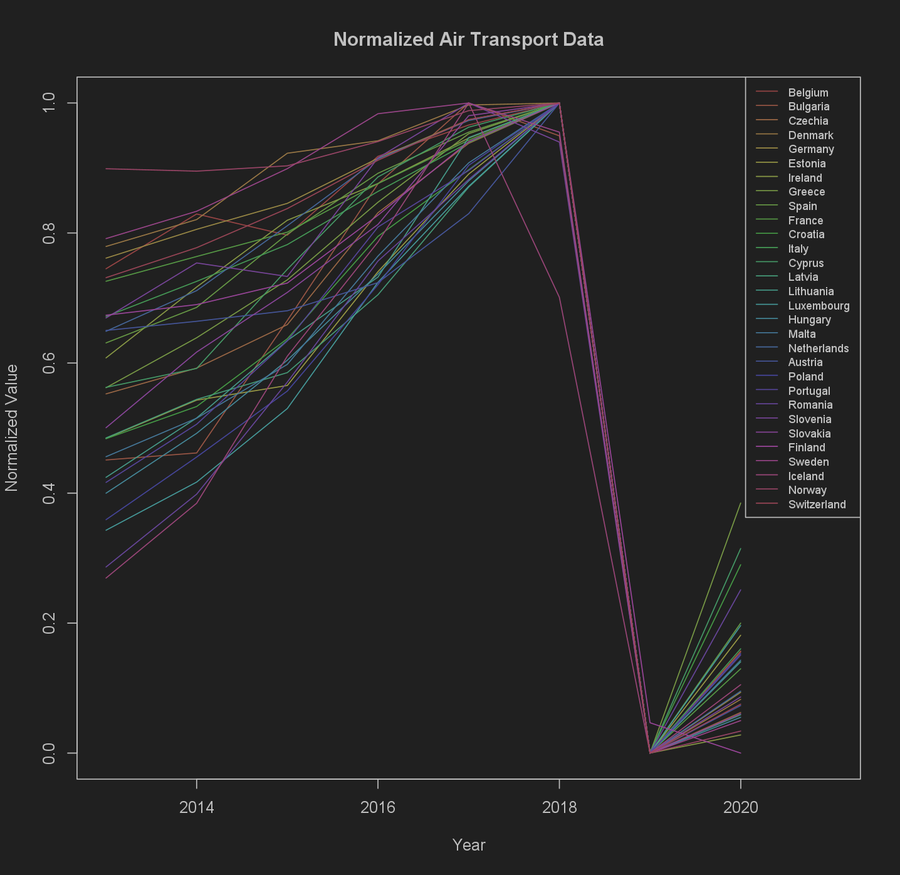

# Statistic Practical

This project was conducted as part of my practical work in statistics. It took place at my university and spanned three days. We examined correlations within a dataset selected from Eurostat. 
 
 

